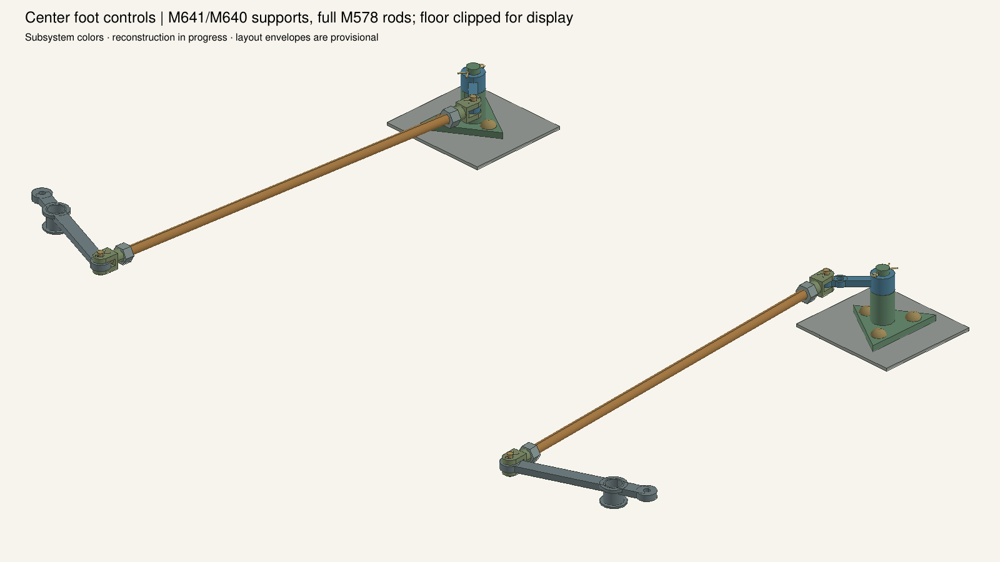
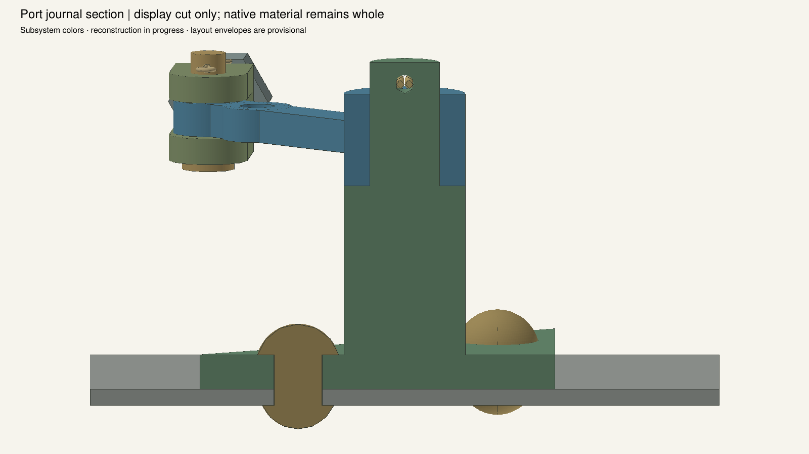

# Rebuilt center foot controls and rear rods

Qualified local static development checkpoint: **3,324 occurrences / 580 definitions /
372 assembly groups**. Open `PowertrainControlRebuild.FCStd` for the complete
powertrain development assembly. Standard tank011 is unchanged.

Adds two M641 floor brackets with integral vertical journals, two shared M640
single-ended arms, six stock-conserving rivets, two split-pin keepers, two M578
rear rods and four complete M569C/M568C joints. Floor 6 receives six actual holes;
all other inherited material and placements are preserved. Both rod eyes are on the same side of each M640 pivot, as supported by
the source views. Selected dimensions, casting profiles and neutral clocking remain estimates.

Nominal `../center_foot05`, variation `../center_foot_variation05`, source review
`../center_foot_source_review02.json` are authoritative. Each passes 115 local
checks, 76 context pairs without mating exemptions, and 37 strict native/STEP
comparisons. Full installation passes 57 checks; all 574 unchanged definitions
are preserved. A fresh build reproduces 1,772 BRep archive entries and all 160,044
persistent properties. `qualification.json` binds 988 dependencies.

Reproduce with `trial_control_rebuild_center_foot_v3.py`, controls05, then
`build_control_rebuild_center_foot.py`. Dimensions regenerate through those
scripts; the saved features are explicit BRep definitions with linked occurrences.

The preceding `center_foot_integrated01` is **rejected**, despite passing material
checks: source-detail inspection exposed the wrong equal opposite-arm M640 and
transverse M641 pivot hypothesis. Preserve its receipts as diagnostics only.

The inner eyes remain open for M579 rods. Intermediate shaft supports, complete
long routes, clutch connections and the driver-control continuation remain active.

