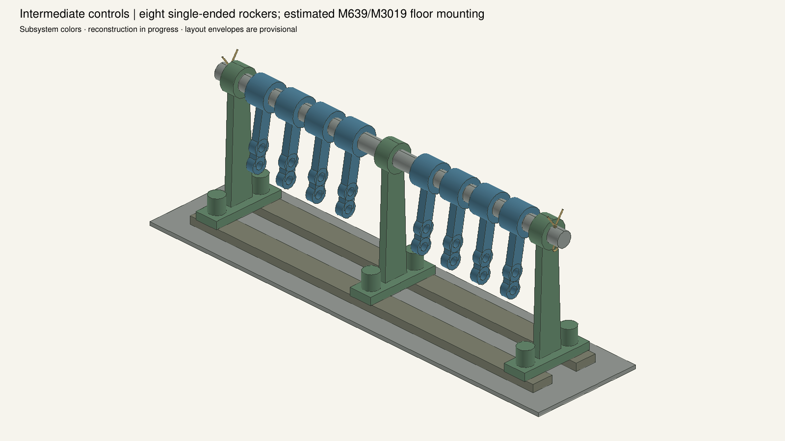
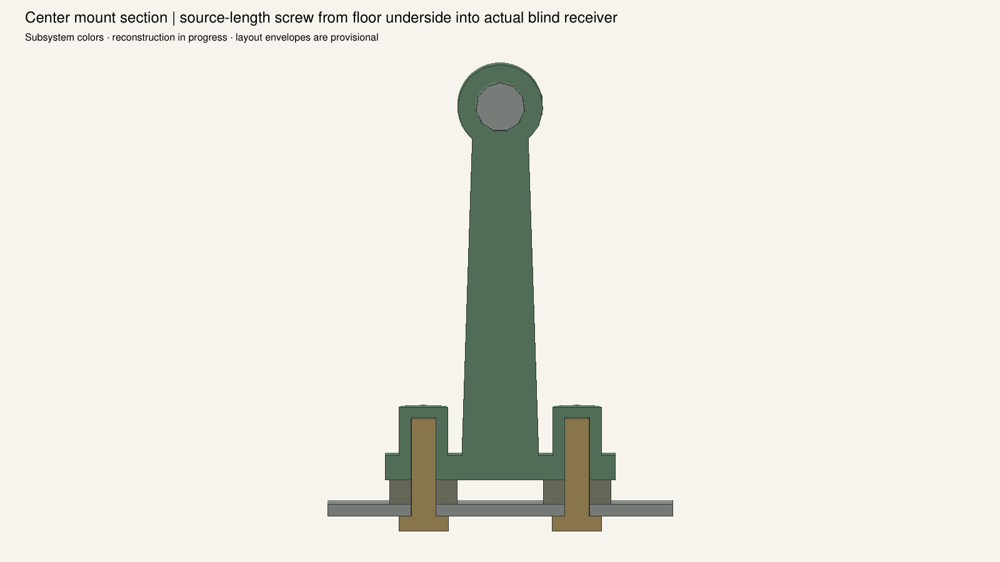

# Intermediate control shaft and eight receivers

Qualified local static checkpoint: **3,347 occurrences / 586 definitions / 385 groups**.
Open `PowertrainControlRebuild.FCStd`. Standard tank011 is unchanged.

The shaft has three actual M639 journal supports, two end keepers and eight linked
instances of the source-correct M640 arm. Routes are reverse1, clutch1, high2,
low2 and foot2. Two M3019 strips support the bracket feet; all six2-inch cap screws
pass through real floor/strip bores and engage blind casting receivers. That
mounting arrangement is an explicit reconstruction hypothesis, not proven history.

M638 X5944.495797 mm derives from the printed49½-inch M574 core length, selected
fork insertion and provisional driver low-speed pin datums [7220,+/-180,890].
Future driver geometry can require a recomputed station. Rocker axial lanes are
provisional until complete rods constrain them.

Nominal `../intermediate02`, variation `../intermediate_variation02`, source review
`../intermediate_source_review01.json`, builder `trial_control_rebuild_intermediate_v2.py`.
Each passes101 local checks,53 context pairs with no exemptions, and29 strict
STEP comparisons. All580 inherited definitions are preserved;43 full-native
checks and fresh reproduction pass. The archive has1,790 BRep entries and161,989
persistent properties. Recovery verification binds989 dependencies.

All saved dimensions regenerate through the builders. The document contains
explicit BRep features and hierarchical linked occurrences. New floor3 geometry
is development receiver context, with six holes; its original source piece mark
remains unresolved. All long rods, high springs, clutch and driver controls remain
active reconstruction work.

