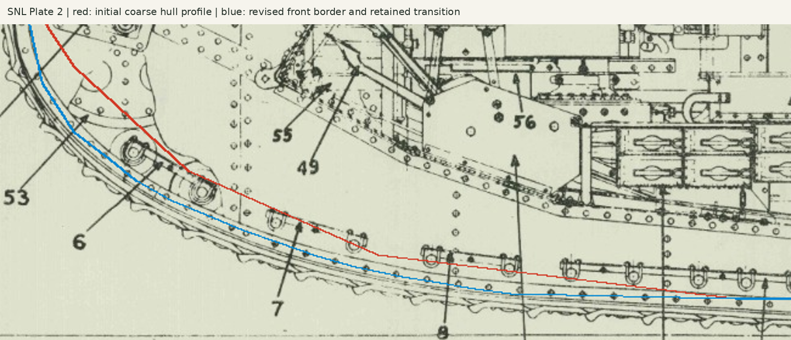

# R02 — lower roller support runs and attachments

Standard geometry integration, 20 September 2026. This partial family adds all
34 SNL-counted lower support angles and 76 short attachment bolts. Full saved-native delivery qualification and eleven parameter trials pass.
The prior [standalone experiment](../experiments/lower_supports/README.md)
established the initial geometry and is preserved as a separate artifact.

## Source scope and ownership

SNL4:019–030 and SNL5:001–002 supply fourteen angle marks. SNL note (gk)
reconciles sixteen outer and eighteen inner pieces; M2175/M2176 replace each
inner No.5. SNL31:001 independently allocates 76 half-inch × 7/8-inch bolts.
Original pages 4, 5 and 31 were inspected. The short-bolt row omits nuts and
washers, whereas the following rows explicitly include them. A tapped hull
receiver is an inferred interpretation; modeled cylindrical engagement does
not qualify threads or structural capacity.

The native hierarchy adds `PortLowerSupports` and `StarboardLowerSupports`
beneath the corresponding running-gear groups. Each has inner/outer banks,
individual run containers, a linked angle and linked attachment bolts. These
occurrences are outside the existing roller-bank source count scope. There are
110 new physical occurrences from 18 definitions, covering fifteen additional
survey identities. The first three symmetric angle designs are reused on all
four mounting faces. A/B identities retain their diagonal inside/outside reuse.
M2085 and M2175/M2176 have explicit reflected construction variants where the
inferred asymmetric drilling/contour prevents rigid reuse of one definition;
this does not assert historically different source parts or interchangeability.

HB144 describes unscrewing plates on support angles before driving out the
lower pins. Their separate source identities, counts and exact forms remain
unresolved. No invented additional plate inventory is included. This is a
partial angle/bolt installation, not completed removable retention.

## Contours and controlling dimensions

| Runs | Installed lower stations | Reconstruction |
|---|---|---|
| 1 / 2 / 3 | 00–01 / 02–03 / 04–05 | Straight inclined angles through paired installed pins; complete roller-unit frames rotate about the transverse axis. |
| 4 | 06–11 | Horizontal pin/washer seats connected by cubic transitions. |
| Outer 5 | 12–15 | Level angle, inferred ends. |
| Inner 5 short / long | 12 / 13–15 | M2176 = 168.275 mm, M2175 = 822.325 mm; inferred 4 mm separation. |
| 6 / 7 | 16–17 / 18–22 | Level runs, inferred ends. |
| 8 | 23–28 | Cubic transitions; ownership of the final two large rear roller outlines is uncertain. |

The independently retained source picks are not rescaled or refitted. Installed
pin positions still follow the reconstructed track with the fixed roller
outside diameter. Lower00 retains its documented rearward offset. Contours and
mounting holes follow those installation datums as parameters change.

The lower stock is independently parameterized at 6.35 mm, with a 34 mm flange,
120 mm flat seat regions and nominal 60 mm end extensions. These are estimates
transferred from the provisional upper support interface. The toe and washer
seat retain the shared pin/clamp heights of +12 and +50 mm. The web is a native
constrained sketch and pad; the flange contains analytic and cubic faces.
Sharp inside corners and vertical stock offsets on the cubic transitions remain
approximations, without a constant-normal-thickness or manufacturing claim.

The attachment plane uses the actual **10 mm skirt**, resolving the former
2 mm gap from substituting the general 12 mm side-wall stock. Bolts retain the
printed 12.7 mm shank diameter and 22.225 mm under-head length. The head's
22.225 mm across flats and 8.73125 mm height remain inferred. Candidate holes
are moved away from pin/clamp centers while preserving the source count,
end edge allowance and distinct bolt spacing. Matching hull holes are owned
by the same datums. Threads are plain envelopes.

A 6.35 + 10 mm angle/skirt stack leaves 5.875 mm of the bolt beyond the shell;
this cannot accept the existing 11.1 mm full nut plus washer. Adding those
components would not be supported by this row or this joint stack.

## Validation scope

The integrated receiving-bore check exposed a real gap hidden by the original
experiment: the initial coarse hull polygon passed above the first front bolt.
An angle/hull contact elsewhere on the run did not prove that bolt had a
receiver. Reinspection of SNL Plate 2 supplied fourteen front lower-border
picks with ±3 pixel uncertainty; the original profile is retained as
`hull_initial_layout`. The inferred transition beyond [509,562] and the older
middle/rear outline remain partial. The revised contour passes checks against actual track hardware; a separate
6 mm nose setback clears four rivet heads at the foremost source vertex.

Source checks reconcile all fourteen angle totals and the 76-bolt row against
the frozen catalogue. Each native angle must retain pin-toe and washer-flange
contact; each bolt head must seat on its angle. The assembled scope additionally
requires an angle/hull face contact and a matching cylindrical receiving face
through at least the modeled skirt thickness for every bolt. These receiver
checks establish geometry only. They do not establish a real thread form.

All lower angle/bolt candidates are checked against the full physical assembly.
The roller validator separately checks every rotated component against its
neighbors, preserving checks on spring/ring phase. Exact pin and washer seats
use native face intersections, not distance alone. The broad phase includes
only the numerical allowance needed to avoid missing coincident bounding planes;
contact and material tolerances remain unchanged.

Integrated trials cover nominal geometry, track pitch +0.5 mm, roller diameter
+1 mm and lower support stock +0.5 mm. The stock trial keeps outside angle
bounds fixed, increases material, moves bolt seats and matching hull bores,
and leaves the separate upper support stock unchanged. Printed inner lengths
and bolt stock are checked independently. Full native, STEP, relocation, independent-build/cache and visual milestone
results are recorded below.

## Delivered qualification

Nominal checks pass 826 material candidates,
424 pin/washer/bolt bearing faces, 34 angle/hull contacts and 76 receiving bores
through the 10 mm modeled skirt. Per-run bolt allocations independently match
SNL31. Native receiving surfaces qualify geometric contact, not threads or
structural capacity. Thirty record/renderer tests pass.

Saved-native validity/placement, both STEP round trips, relocated links,
independent rebuild/cache reuse and all eleven parameter trials pass. Native
generation took 40.87 s; independent/cached rebuilds took
59.92 / 42.20 s.
The source lock verifies 733 files and the unchanged survey.

Preserved [isometric 008](../../intermediate_snapshot_iso_008.png) and an
[installed front support detail](../../intermediate_snapshot_detail_supports_008.png).
Earlier snapshots remain byte-identical. Drive assemblies, remaining support
retention and hull fittings, and identifiable exterior/interior systems remain
in progress. Complete-tank and historical-fit verification remain false.

Next-stage geometry preparation is recorded in the separate
[drive-wheel study](../experiments/drive_rims/README.md). Its shared-part candidate
clears 1,626 material pairs at the four installation axes; source conflicts,
shaft/support completion and integration remain open.

