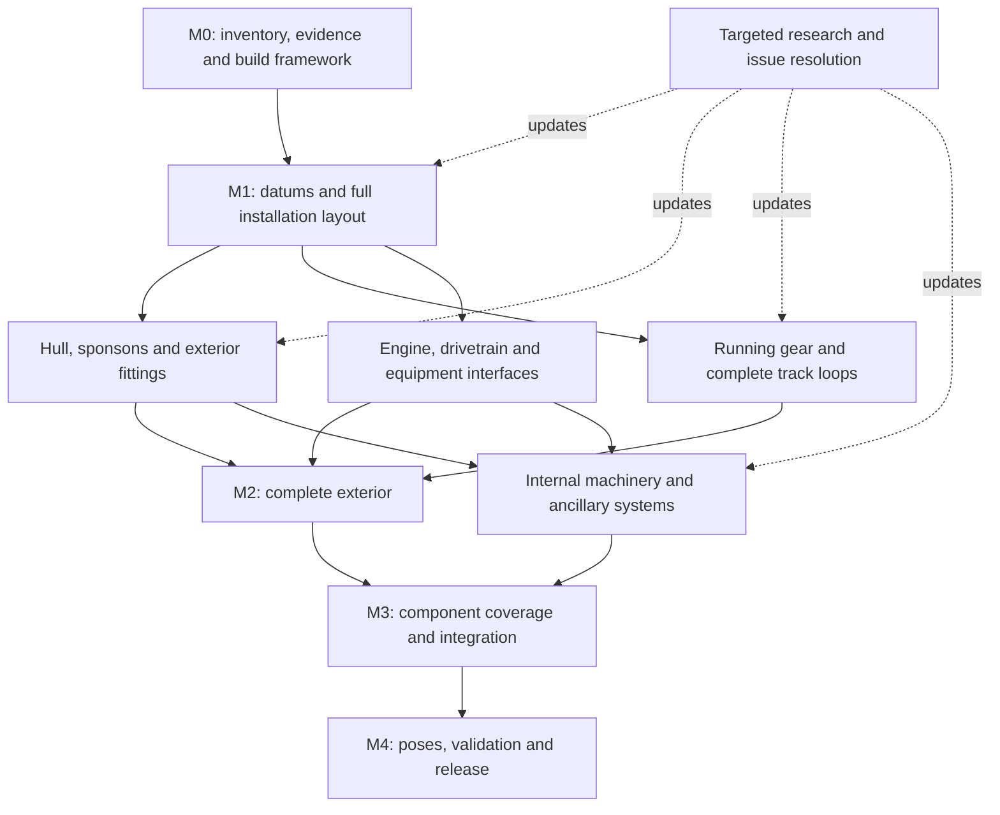

# Workflow for a complete Mark VIII CAD reconstruction

Prepared 19 September 2026. This is the implementation workflow for extending the
[validated foundation pilot](../cad/002_Foundation/README.md). The full-tank
pipeline and the geometry described below are delivery requirements; initial
implementation progress is recorded in
[the full-tank stage](../cad/003_FullTank/PROGRESS.md). The
[execution queue](../cad/003_FullTank/work_queue.json) records that work; the
[work-packet template](templates/cad-work-packet.md) defines each deliverable.

## 1. Target and working decisions

Build an evidence-led, full-size, hierarchical FreeCAD reconstruction of the
**1919–1920 Rock Island first-100 production tank**. Preserve the decisions already
made: script-led native CAD, documented approximations, and priority for parts that
improve the complete appearance without compromising useful geometry.

The confirmed scope is **all identifiable installed components, including interiors**.
Provide a static level-ground assembly and selected documented hatch, sponson and
service poses, as selected by the user on 19 September 2026. Continuous mechanical
simulation would be a separate extension.
Portable equipment and stowage belong in the inventory, with an explicit selected
loadout. Spare quantities are separate from installed quantities.

Current execution priority, confirmed by the user: **fully populate the standard
assembled configuration, including the selected interior scope, before developing
pose variants**. Pose research can be retained, but pose implementation follows
the standard-geometry coverage gate.

This is a reconstruction of a production configuration, not a claim to reproduce
one particular serial number. Preliminary, later service, aircraft-engine and
museum evidence retain their applicability qualifications. A later configuration
must be a deliberate selection of alternatives, not additional parts superimposed
on the production assembly.

### What “complete” will mean

The final assembly contains a representation of every identified, applicable,
in-scope physical component. Documented approximations can be finished
reconstruction parts when their form, interfaces and uncertainty are recorded.
Temporary bounding boxes, unfinished coupons and unidentified placeholders cannot
satisfy the component-detail completion gate.

Report three different outcomes:

| Measure | Completion rule |
|---|---|
| Inventory reconciliation | Every survey identity has a disposition: included, excluded with reason, merged through a reviewed mapping, nonphysical, or unresolved. Unresolved scope/identity decisions remain visible and must be settled for the declared final coverage. |
| Geometric coverage | Every selected component definition has its required representation, and every expected installed occurrence has a location and parent. Repeated hardware counts cannot conceal missing unique equipment. |
| Evidence coverage | Each defining parameter and placement has evidence or an explicit assumption. Directly supported, transferred, scaled and estimated geometry are reported separately; 100% geometric coverage does not imply 100% known historical dimensions. |

The survey omits some proprietary commercial internals and may not enumerate every
unnamed fitting. Record these as **unquantified inventory gaps**, with the affected
assembly and research needed. A final release can be complete within a declared
coverage boundary while still documenting such gaps; it must not claim an
exhaustive original manufacturing BOM. An intentionally simplified or excluded
interior must be named in that boundary, not hidden by the word “complete.”

## 2. Starting point and technical approach

The [survey](../cad/001_Survey/survey_report.md) supplies 5,482 canonical records,
3,879 assembly/arrangement assertions, source locators, figures, dimensional prose,
configuration conflicts and research leads. These are inputs for constructing a
vehicle BOM, not a ready-made assembly tree or manufactured-piece count. Absence
of configuration membership means unclassified, not universally applicable.

The pilot supplies nine reusable native definitions and 32 physical solid
occurrences, source-linked parameters, conditional drawing calibration, native
links, STEP export and passing validation. It proves the installed runtime can
perform this work. It does not establish full-vehicle performance or complete
historical geometry. In particular:

- The vehicle blockout is reference geometry; it must become separate plates,
  frames, openings and installed equipment.
- Track link webs lack their complete shapes and connections; there are no
  complete track loops.
- The roller units omit their supporting/suspension components, and retaining-ring
  interpretation remains open.
- The M2078 support is a local straight coupon, not a complete historical part.
- The present whole-build validator assumes 32 solids and examines all pairs;
  the full-tank implementation needs inventory-driven checks and spatial filtering.

Use **native BRep solids with analytic and NURBS geometry**. FreeCAD supports both
through its Open CASCADE geometry engine. Use planes, circles, pads, pockets and
revolutions for plates and machined parts; constrained splines, lofts and surface
patches for castings, pressed shapes and curved transitions. FreeCAD's
[geometry overview](https://www.freecad.org/features.php) describes these supported
representations. The project's choice is to preserve simple exact geometry where
it fits the part, rather than make every surface a spline.

For a genuinely freeform part, retain the section curves, control points, degree,
constraints and fit residuals. Join and trim the surfaces into a checked closed
solid. A visually smooth surface alone is not a finished volumetric part. If a
downstream consumer specifically requires all-NURBS geometry, generate a separate
converted export and verify it against the authoritative native solid.

Keep editable native features wherever practical. For a scripted surface feature,
retain editable inputs and its generator even if it has no Sketcher equivalent.
Record which parameters update directly in FreeCAD and which require a rebuild.
GUI experiments become authoritative only after their useful changes are captured
in the scripts/data.

## 3. Organize the model before multiplying parts

The following is the proposed installation hierarchy. Refine it from the selected
production inventory; catalogue headings do not dictate physical ownership.

```text
MarkVIII_RockIsland
  HullStructure
    MainFrame / ArmorPanels / Bulkheads / Floors
    UpperEnclosures / HatchesAndDoors / ExternalFittings
  RunningGear
    Port / Starboard
      TrackFrame / Suspension / Rollers / DriveWheel / Idler / TrackLoop
  Sponsons
    Port / Starboard
      ArmorAndFrame / HingesAndSupports / ShieldsAndExternalMounts
  Powerplant
    TankLibertyEngine / EngineMounts / IntakeExhaust / Lubrication
  Drivetrain
    Clutch / Transmission / FinalDrives / BrakesAndSteering
  CoolingVentilation
    Radiators / FansAndDrive / Ducts / PipesAndHoses
  FuelPressure
    Tanks / Mounts / Pumps / Controls / LinesAndFittings
  ElectricalInstruments
    StartingCharging / Batteries / WiringConduit / PanelsAndInstruments
  CrewControlsAndEquipment
    Controls / Seats / Stowage / SelectedPortableEquipment
  ArmamentRepresentation
    ExternalEquipment / InstallationInterfaces / StowageEnvelopes
  ReferenceGeometry                 [excluded from physical exports and BOM]
```

Give each physical item exactly one owning installation parent. A shared shaft,
bracket or fastener may be referenced by another system's interface record without
creating another physical occurrence. Mount components can belong to a sponson
while external equipment belongs to the equipment assembly; the interface registry
states the connection.

Distinguish four identities:

| Identity | Purpose |
|---|---|
| Survey identity | Preserved source inventory key, with original marks/drawing numbers retained separately. Several sources or unresolved identities may need a reviewed mapping. |
| Model definition | One geometric design and revision, including configuration applicability and handedness. Reuse only when interchangeability is supported. |
| Occurrence | One installed instance, with stable ID, parent, local placement, quantity scope and interface references. |
| Representation | Layout envelope, assembly detail or inspection detail for the same definition/occurrence. Switching detail must not change the BOM or duplicate physical mass. |

Use `App::Part` containers and `App::Link` occurrences, with the built-in assembly
container where appropriate. Links can refer to objects in the same or another
document, as described in the official
[App::Link documentation](https://github.com/FreeCAD/FreeCAD-documentation/blob/main/wiki/Std_LinkMake.md).
The pilot already demonstrates external native links and relocation on this system.

Group native files by reusable component family or independently deliverable
assembly. Do not create a new file for every installed bolt. The top-level document
should link subsystem documents; shared component definitions live in a common
library. Use relative paths and deliver the complete dependency directory.

## 4. Authoritative records and coordinates

Keep `cad/001_Survey/` frozen. Keep `cad/002_Foundation/` as the working regression
example. Develop the complete model under `cad/003_FullTank/`; its README describes
the planned layout. The following records must be versioned outside generated
`build/` directories:

| Record | Required content |
|---|---|
| Configuration/inventory | Included and excluded identities, applicability evidence, installed quantities and scope, alternatives, gaps, original identifiers, revision history. |
| Parameters | Typed value and units, original notation, interpreted feature, evidence locator, configuration applicability, nominal/uncertainty bounds, derivation and dependent definitions. |
| Calibrations | Original image checksum, source/PDF and printed-page locators, image transforms, controls, independent checks, residuals and trace points. |
| Datums/interfaces | Named coordinate frames, axes, mounting planes, hole patterns, contact surfaces, permitted adjustments and owning subsystem. |
| Definitions/occurrences | Builders, part metadata, representation choice, parent-relative placement, handedness and expected quantities. |
| Poses | Named alternative placements, applicable configuration, supported ranges and evidence; exploded views separately marked as presentation. |
| Issues/research | Conflicting statements, affected geometry, disposition, bounded approximation or blocked status, and the next evidence that could change it. |
| Releases | Input/runtime fingerprints, dependency manifest, coverage and validation reports, source revision and artifact checksums. |

Retain the pilot axes: **X forward, Y port, Z up**, in millimeters. The origin is
on level ground beneath the rear drive axle at the vehicle centerline. Establish
subsystem-local datums for wheel axes, engine mounts, transmission input/output,
sponson hinges, bulkheads, radiator mounts and pipe connections.

Place parts from these datums, rather than copying global coordinates or attaching
critical interfaces to generated face numbers. Changing a mounting station must
move the connected parts and identify routes or clearances requiring revalidation.
Use rigid transforms with explicit orientation conventions; verify nested
translations and rotations before generating full track loops or poses.

Extend the pilot's scalar parameter format deliberately: lengths, angles, integer
counts and other quantities need appropriate units and dimensional checks.
Distinguish a documented number from confidence in applying it to this production
configuration. A transferred handbook dimension can be exact in transcription
while uncertain in applicability. Bounds describe reconstruction uncertainty,
not manufacturing tolerance. Shared calibration uncertainty should propagate
together, not become unrelated random errors for every coordinate.

## 5. The repeatable modeling cycle

One work packet is a coherent part family, joint or subassembly that can be built,
installed and reviewed together. Use the [template](templates/cad-work-packet.md).
Finish this cycle before multiplying the result through the tank:

1. **Establish identity and scope.** Select configuration, survey IDs, original
   marks, installed quantity and parent. Separate features, consumables, spares and
   alternatives. Check both component-linked issues and source-wide conflicts.
2. **Prepare the evidence.** Open relevant scans/sections as well as transcription.
   Extract the specific dimensions and arrangements. Retain source coordinates,
   crops and competing interpretations. AI/OCR suggestions need source inspection
   before becoming dimensional facts.
3. **Define the part and its interfaces.** Create a dimension/assumption table,
   local frame, envelope and connection geometry. Identify which unknowns affect
   adjacent parts. Resolve or bound those before adding surface detail.
4. **Construct the native part.** Build the simplest suitable solid/features, then
   add supported forming, cast surfaces, holes and visible detail. Avoid adding
   undocumented precision merely because the software permits it.
5. **Install a representative assembly.** Use actual owning parents and interface
   transforms. Check mates, axial stacks, holes, access and orientation. A reusable
   part is not finished until it fits its intended assembly.
6. **Validate and perturb.** Check topology, recompute, quantity and placement;
   compare sections and silhouettes; vary the important uncertain parameters
   within coherent bounds. Verify dependent instances update or are invalidated.
7. **Generate the review bundle.** Native files, STEP for physical geometry,
   orthographic/isometric and relevant section views, evidence/assumption notes,
   issues, coverage changes and validation results travel together.
   At each significant visual improvement, preserve a byte-for-byte copy of the
   current standard isometric rendering as
   `cad/intermediate_snapshot_iso_NNN.png`, using the next unused number after
   the existing snapshots. Keep the established camera/style where practical.
   Preserve earlier images, skip identical copies, and append the milestone,
   date and image hash to `cad/VISUAL_PROGRESSION.md`. This is the user's requested
   visual history; routine rebuilds do not each need a snapshot.
   From milestone011 onward, also render a transparent-hull companion with
   opaque running gear and interior components (user request, 20 September).
   Use `python3 cad/003_FullTank/tools/transparent_isometric.py` after the native
   build; default armor opacity is 18%. Save it as
   `cad/intermediate_snapshot_iso_transparent_NNN.png`, alongside the opaque
   image. Keep both views available in the progression viewer. Transparency
   changes the inspection display only; provisional interior envelopes must
   remain identified. Earlier snapshots stay unchanged.
8. **Integrate and record disposition.** Mark the packet accepted, accepted with
   documented approximation, needing revision, or blocked with a specific cause.
   Update dependent work. Retain superseded evidence decisions in the history.

Routine reversible modeling and checks proceed under the project's existing
authorization. Technical review is part of producing the deliverable, not an
automatic request for user permission at every step. Ask for direction when a
material scope or historical interpretation cannot be resolved from the evidence
and the existing approximation policy.

## 6. Delivery stages and dependencies

Milestones are reviewable outputs, not fixed calendar promises. Research and
modeling can advance independently where interfaces are already bounded. Archive
retrieval is an external dependency, not a reason to stop all other geometry.

| Stage | Result | Exit gate |
|---|---|---|
| M0 — Production framework | Applicability ledger, model schemas, modular build, interface conventions, prioritized evidence decisions. | Candidate inventory triaged; every initial packet has a scope and evidence path; existing pilot regression preserved. |
| M1 — Complete arrangement | Entire vehicle assembled from layout representations; all major systems occupy plausible space. | Axles, compartments, mounts, sponson interfaces and major equipment envelopes coexist; unresolved envelopes carry bounds. |
| M2 — Complete exterior | Hull, upper structures, both sponsons, full running gear/tracks and visible equipment. | No temporary blockouts in the exterior scope; all visible selected components have finished or accepted approximate representations; hidden unfinished work remains listed. |
| M3 — Component reconstruction | Internal structure, machinery, ancillary systems, controls and stowage detailed to the selected coverage. | Required definition and occurrence coverage achieved, including hidden fittings; unknown proprietary inventories explicitly bounded by the release scope. |
| M4 — Integrated release | Checked poses, native assembly, exchange files, visual atlas, BOM, evidence and reproducible package. | Final coverage, geometry, installation, relocation and export gates pass for the stated configuration and representations. |



### M0: turn the survey into a production modeling inventory

Triage all 5,482 records without pretending every record is a separate solid.
Resolve the 37 survey review records as evidence permits. Select production
alternatives and distinguish installed, spare, set, subassembly and feature
quantities. For each subsystem, record identified definitions, expected
occurrences, unresolved quantities and unquantified inventory gaps.

Create explicit dispositions for the pilot's simplified link webs, ring fit,
representative stations and support coupon. Reuse sound parameter/evidence and
builder techniques; do not promote the pilot's approximations into completed
historical parts by copying their labels.

Extract the tested runtime, source checks, metadata and export routines into a
modular implementation only as needed. Add subsystem builds, representation
selection, input/dependency fingerprints, rotation checks and coverage reporting.
Keep the pilot's fixed-count tests in its own fixture. Qualify a representative
repeated assembly before generating thousands of occurrences.

### M1: solve whole-vehicle packaging

Use a longitudinal skeleton plus cross-sections, plate planes and interface frames.
Carry both the overall envelope and component-specific thicknesses as constraints.
Record where production applicability remains uncertain.

The pilot found SNL Plates 1, 3, 4 and 10 to be perspective photographs; they cannot
supply a global orthographic millimeter-per-pixel scale. Plate 2 and Plate 29 have
conditional metric calibrations. Preserve their independent checks, including the
Plate 29 roller-width disagreement. Obtain additional sections or defensible local
plane measurements for transverse geometry. Fitting the envelope and then checking
the same envelope is not independent validation.

Install layout representations of the tank engine, clutch/transmission/final
drives, fuel tanks, cooling system, electrical equipment, crew positions and
stowage while establishing the hull. Define access openings and routing corridors
now. This prevents a visually complete hull from later needing wholesale revision
to fit its contents. Mass properties remain provisional unless material, thickness
and interior geometry justify them.

### M2: deliver the complete exterior

Develop the following packets against the M1 installation model:

| Family | Modeling work | Essential check |
|---|---|---|
| Hull and track frames | Full panel boundaries, actual plate thickness families, frame/angle construction, bulkheads and principal joints. Replace the M2078 coupon with its full extent. | Plate intersections, laps, ground/track clearance, mounting and compartment datums. |
| Upper structures and sponsons | Roofs, enclosures, outlook, doors, hinges, shields, side openings, supports and visible fittings. | Production-specific panel arrangement, hinge axes and adjacent equipment clearance. |
| Wheels and suspension | Drive/idler forms, shaft/bearing/support assemblies, spring and plain roller stations, return rollers and adjustment arrangement. | Section stack, correct station/quantity scope, track contact and tensioner bounds. |
| Track units and loops | Finish a representative shoe/link/pin/bush connection, then place a full loop on each side using constant pin pitch. | Rigid-link closure, wheel engagement, handed orientation, no stretching or duplicated end unit. |
| External equipment | Intake/exhaust outlets, covers, lifting/towing fittings, visible instruments/fittings and external armament representations. | Placement, silhouette and comparison with production evidence; museum variants labeled. |
| Visible fastening | Joint-driven rivet, bolt, nut and washer families and patterns. | Correct grip stack, head form, spacing evidence and physical occurrence ownership. |

**Track closure is a dedicated engineering packet.** Jordan gives 78 shoes per
track; the handbook pitch is 11.154 inches. Preserve printed rounding and source
applicability. Solve successive pin-center positions with fixed inter-pin
distance around the running gear, adjusting only supported layout/tensioner
degrees of freedom. Equally spaced samples along a smooth outline do not establish
rigid-link closure. Check all joints, the closing joint, adjacent shoes and wheel
contact. If the available constraints disagree, report the residual and affected
assumptions; do not rescale individual shoes to force a fit.

Do not confuse the road-track drive wheel with the smaller final-drive chain
sprocket. Preserve the survey's roller quantity scopes: the stated 58 lower rollers
already include 28 spring and 30 plain; the two upper rollers are a separate
statement. Confirm the arrangement scope before converting these into occurrences
on each side. Mirror placements only after checking handed geometry and orientation.

### M3: fill the interior and complete the parts coverage

Refine systems in interface dependency order, while retaining the complete exterior:

1. **Structure and machinery supports:** inner framing, floors, bulkheads, mounts,
   brackets, access panels and connection hardware.
2. **Tank engine and lubrication:** tank-specific exterior and installation first;
   then supported cylinders, crankcase, rotating assemblies, valve gear and
   lubrication details. Aircraft-only parts and unresolved tank variants remain
   explicitly separated.
3. **Drivetrain:** housings and shaft/bearing stacks, clutch, transmission, final
   drives, brakes, steering and control connections. Unsupported gear teeth or
   bearing internals remain declared simplified representations until sufficient
   data supports their refinement.
4. **Cooling and ventilation:** radiator tanks/cores, fans, drive, ducts, mounts
   and hoses. The survey's 303-tube statement applies to each named core, not the
   entire vehicle. Detailed repetition follows a validated representative element.
5. **Fuel and pressure:** production tank shells/mounts, pumps, carburetor exterior
   and interfaces, controls, lines and fittings. Capacity alone does not determine
   a tank's shape or resolve the gallon convention.
6. **Electrical and instruments:** starting/charging equipment, batteries,
   instrument cases, switches, conduit, terminals and wiring. Resolve production
   equipment selection before expanding later service lists.
7. **Crew controls, equipment and stowage:** seats, pedals/levers, linkages, floors,
   fittings, racks and selected carried equipment. External armament and mounting
   representations support historical arrangement, pose and space checks.
8. **Completion sweep:** gaskets, packing, clamps, hidden fasteners, retainers and
   remaining known components. Reconcile every modeled occurrence with its
   inventory owner and every inventory requirement with a model or named gap.

Route pipes, hoses, conduit and wiring between established ports and supports.
Use documented lengths/end sizes where available; label inferred bends and sag.
Check access and clearance in section views. Avoid fixing a hose route against a
temporary machinery envelope without recording that dependency.

### M4: poses, integration and release

Create named configurations of supported openings and service positions using the
same occurrence IDs. Separate deployed/withdrawn sponson states from external
equipment transport positions; the patent and handbook do not establish one
universal mechanism or dimensioned movement path. Keep an exploded view distinct
from a physically attainable pose.

For each claimed motion range, verify the endpoints and intermediate positions or
swept clearances. If only static positions are supported, deliver only those and
record that the path is unresolved. Do not make a full linked-track dynamic solver
a prerequisite for a static, component-complete reconstruction.

## 7. Research that most affects the model

These are existing survey/pilot leads, not claims of newly recovered drawings.
Each evidence task should end with a usable dimension/decision or a precise gap
and fallback; downloading an entire collection is not itself progress in geometry.

| Priority | Question | Current lead and modeling response |
|---|---|---|
| 1 | Original installation, plate and mount coordinates | Ordnance/Rock Island drawings; survey lead for National Archives identifier 26417262, container 5, item “Mark VIII Tank.” Individual engineering sheets remain unverified. Use bounded datums meanwhile. |
| 1 | Production engine and fuel equipment | Jordan versus preliminary handbook; three 50-gallon versus three 80-gallon tanks, Ball & Ball versus other carburetors, tank/aircraft interfaces. Establish alternatives explicitly before fixing shapes and mounts. |
| 1 | Track and suspension fit | Full link/pin form, wheel engagement, roller station scope, retaining-ring convention and SH642B's contradictory dimensions. Resolve or isolate conflicts; never feed impossible dimensions into a builder. |
| 1 | Production electrical equipment | Bijur starter/generator/T461 and conflicting electrical descriptions. Model supported exterior/interfaces first; proprietary internals remain an identified inventory/evidence gap. |
| 2 | Hardware and omitted equipment | Missing SNL G-13 Changes No. 1 and common-hardware lists; inspect the locally added 1921 Screw Thread Commission report for exact applicable entries. Period U.S., British, pipe and special threads need separate interpretation. |
| 2 | Proprietary fittings, bearings and instruments | Inspect relevant pages in the locally added 1906 Lunkenheimer catalogue; exact matches have not been established. Follow the survey's Timken, instrument, hinge and conduit-box leads with date/part-number checks. |
| 2 | Hidden exterior and installation observations | Use the source strategy in the modern-reference index for targeted survivor images/frames. Record vehicle, date, viewpoint and restoration status; do not infer hidden geometry from appearance alone. |

Keep new evidence in an additive research/modeling revision with its own manifest
and survey-ID mappings. A revised survey is a new baseline, not an overwritten
frozen database. Update source locks only after reviewing the actual changes.
Purchases, archive correspondence or museum measurement visits are separate actions
to arrange when needed; this workflow has not initiated them.

## 8. Validation at part, subsystem and tank scale

| Gate | Required evidence |
|---|---|
| Source and configuration | Locators and hashes resolve; applicability decisions are explicit; incompatible alternatives are not simultaneously installed. |
| Native geometry | Recompute succeeds; intended solids are closed and valid; surface-only references are classified; required features/parameters remain accessible. |
| Installation | Expected occurrences have unique IDs and correct nested transforms, handedness, parents and interface alignment. Quantity mismatches and unknown counts are reported. |
| Fit and clearance | Check relevant hole/shaft and axial stacks, contacts, panel overlaps, route clearances, track closure and pose-specific interference. Intentional contact/interference requires a specific pair/interface and rationale. |
| Evidence comparison | Compare orthographic projections, sections and perspective-matched views with retained references. Record independent residuals and differences, not just attractive renders. |
| Change propagation | Perturb an interface or representative parameter; verify affected parts/occurrences update and dependent checks rerun. Test rotations, representation switches and missing-link diagnostics. |
| Exchange and portability | Reopen native files after relocation; reopen STEP and compare intended solids, placements, hierarchy, bounds and volume within declared numerical tolerances. |
| Reproduction | A clean build from locked inputs/runtime produces equivalent geometry, BOM and placements. Compare geometric signatures; compressed native files need not have identical byte hashes across independent saves. |

Numerical geometry tolerances, historical uncertainty and physical fit allowances
are different quantities. The pilot's STEP tolerances validate export equivalence;
they do not confer micrometer knowledge of the original tank. Do not publish
precise mass, center of gravity or fit claims derived from unfinished interiors.

For large assemblies:

- Build unchanged definitions once using hashes of code, parameters, sources,
  interfaces and runtime. Invalidate downstream dependents when any input changes.
- Provide layout, assembly and inspection representations; detail threads,
  rolling elements and radiator fins only where the representation calls for them.
  Keep logical component accounting independent of displayed detail.
- Use bounding boxes and a spatial index to select possible collision pairs,
  then exact geometry checks for those pairs. Avoid the pilot's all-pairs distance
  check over the entire tank.
- Validate modified parts and adjacent interfaces during iteration; run complete
  coverage and integration checks at milestone/release boundaries.
- Measure build/open/recompute/export time, peak memory and file size on a repeated
  track section, one full side and the integrated model. Set practical budgets from
  those measurements before adding dense hidden detail. Do not promise full-tank
  interactive performance from the small pilot result.

The tested FreeCAD installation, Python, PyMuPDF, Pillow, NumPy and SciPy cover the
planned initial workflow. No additional installation is required to start M0/M1.
Use the existing sandbox-compatible launcher; record and requalify runtime changes.
An optional workbench or external processor should solve a demonstrated gap before
becoming a project dependency.

## 9. Review and delivery

Each milestone package should contain:

- A top-level `.FCStd`, linked subsystem documents and reusable part library.
- STEP exports for physical parts/subsystems and an integrated representation,
  with export scope and hierarchy limitations stated.
- Exterior views, interior sections, subsystem/exploded views and source overlays.
- Definition and installed-occurrence BOMs, including quantity scope and selected
  loadout; no double-counted assemblies or alternative representations.
- Coverage tables by subsystem and by unique definition, installed occurrence,
  visible component and interface. Report unknown denominators separately.
- Evidence, assumptions, open gaps, parameter bounds and a revision/change log.
- Validation results, environment lock, build instructions and a checksum manifest.

Automated work handles source lookup, candidate extraction, parameter conversion,
repeated geometry, placement, exports and diagnostic reports. Source interpretation,
transverse shape inference, proprietary-equipment identification and visual review
still need explicit judgment. The review bundle should make those judgments easy
for a knowledgeable human to inspect and correct. Useful corrections become
versioned inputs and propagate through the next build.

After each representative packet, record effort spent on evidence, geometry and
integration separately. Forecast remaining work by unique part families and
unresolved interfaces, not by multiplying the survey record count by a guessed
minutes-per-part. Repeated shoes and bolts are cheap only after their definitions
and installation patterns have been validated.

## 10. First execution sequence

The [work queue](../cad/003_FullTank/work_queue.json) is the authoritative initial
list of packet IDs, dependencies and acceptance criteria. All full-tank packets
start as `planned`; the existing pilot is a prerequisite, not a completed
full-tank stage.

Begin with **F01–F03**: reconcile the production candidate inventory, define the
parameter/interface/occurrence contracts, and establish the modular build with
pilot regression. Conduct **E01**, a bounded evidence review of the interfaces
that control the first layout. Then complete **L01–L02**, the multi-view datum
skeleton and installed layout of all major systems.

The first visible delivery after that framework should combine **H01**, **S01**
and a representative **R01–R02** running-gear installation: full hull panel forms,
sponson/upper-structure forms and one complete running-gear family installed at
real modeled stations. Solve **R03**, both complete track loops, before claiming
the exterior milestone. Machinery packaging and exterior fittings proceed against
the same datums. Subsequent work follows the dependency graph through interior
completion and the final release gates.

## Local evidence behind this workflow

- [Survey findings, readiness, conflicts and research leads](../cad/001_Survey/survey_report.md)
- [Survey interpretation rules and quantity caveats](../cad/001_Survey/README.md)
- [Foundation implementation and runtime](../cad/002_Foundation/README.md)
- [Pilot visual review and calibration residuals](../cad/002_Foundation/VISUAL_REVIEW.md)
- [Primary-source strategy](primary-sources.md)
- [Modern observational-source strategy](modern-reference-sources.md)
